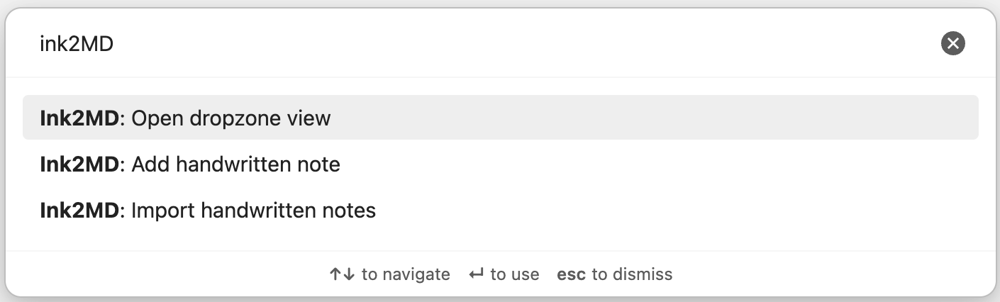
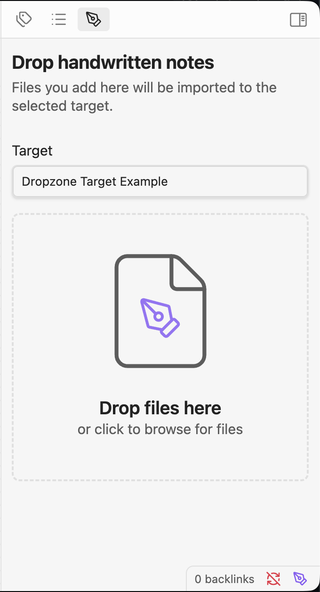
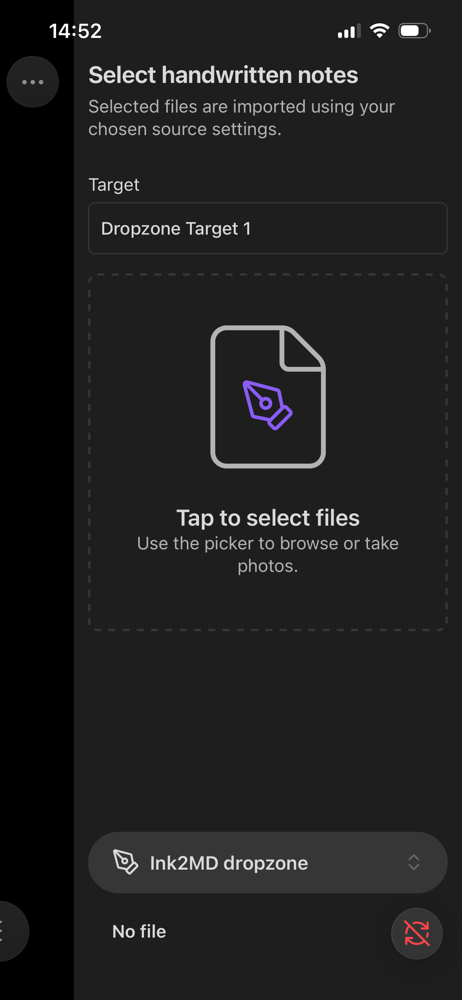
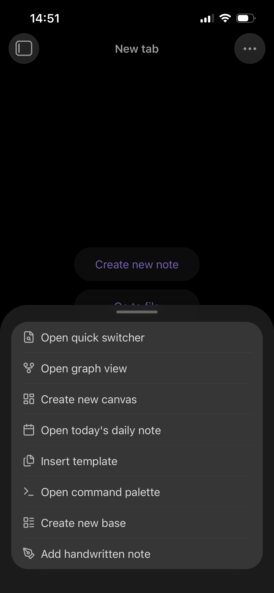
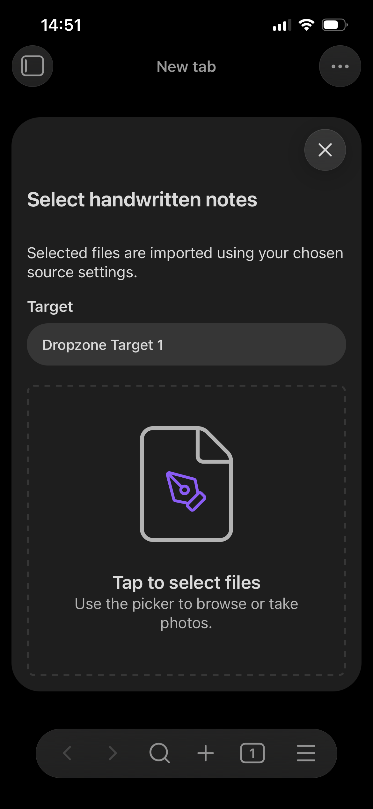
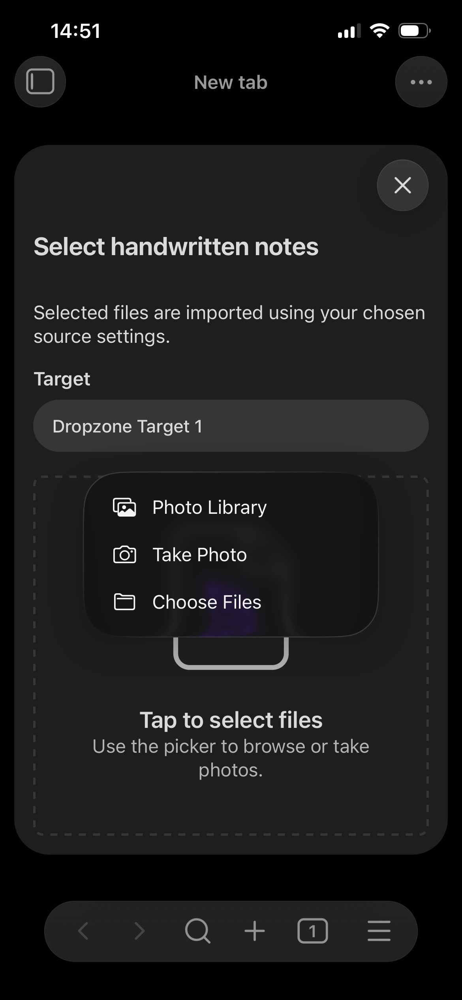
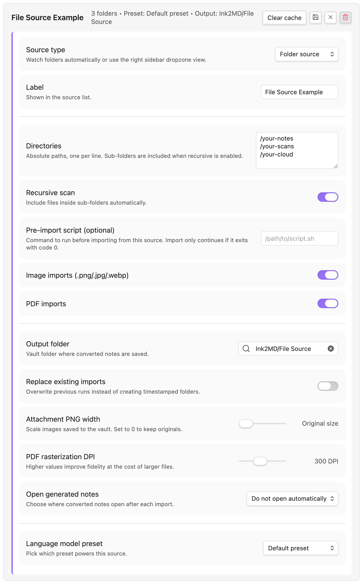
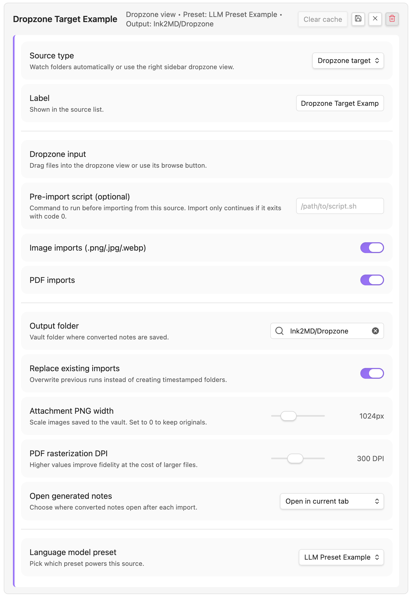
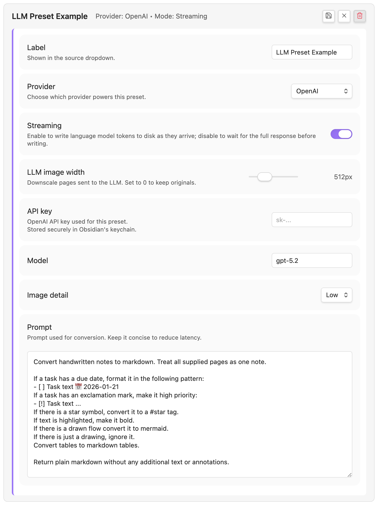

# Ink2MD

Ink2MD imports your handwriting into Obsidian as Markdown. Point it at the folders that sync your handwritten notes, drop images of sticky notes or whiteboards into the app, or snap a fresh photo, and Ink2MD converts each page to PNG, runs OCR with a vision-capable LLM (OpenAI, Azure OpenAI, Anthropic, Google Gemini, or any OpenAI-compatible local endpoint), and writes rich Markdown next to the attachments in your vault.

---

## Use cases
- **Phone photos**: snap handwritten notes, whiteboards, sticky-note walls, or flip charts directly in Ink2MD on your phone. Your workshop recap is ready before the sticky notes fall off.
- **PDF and image imports**: sync notebooks or sketches from your favorite handwriting tablet (Remarkable, Supernote, iPad apps, etc.) to a cloud folder you trust. Point a filesystem source at that folder and kick off the desktop import to convert every page automatically. Ink2MD remembers what you already processed, so your folder stays in sync without re-importing unchanged files.
- **Task-heavy notes**: use exclamation points or due dates in your handwriting? The default prompt converts `!` into `- [!]` tasks and recognizes 📅 dates so your planner stays structured.
- **Personal symbols, personal tags**: customize the prompt to turn your own shorthand into tags. `★` can become `#star`, a heart can become `#heart`, or anything else you jot down.
- **Flowcharts and tables**: scribble mermaid-like diagrams or tables and let the LLM translate them into real Mermaid blocks or Markdown tables.

> [!tip]
> **You do you** – Ink2MD is intentionally flexible. Create as many LLM presets as you like, even multiple presets for the same provider, with different prompts, attachment widths, or streaming settings. Use a narrow width for close-up handwriting, a wider one for photos of sticky notes on a distant wall, or tailor a prompt that tags your personal shorthand. You do you.

---

## Requirements
- Obsidian 1.6.0 or later.
- Desktop Obsidian unlocks filesystem sources, pre-import scripts, and absolute-path hashing.
- Mobile Obsidian supports the dropzone picker; desktop-only actions are hidden automatically.

---

## Installation
- **Community Plugins (future)**: Ink2MD aims to ship on the Community Plugins catalog. Once it’s there, you’ll be able to install it directly from Obsidian.
- **[BRAT (Beta Reviewers Auto-update Tester)](https://github.com/TfTHacker/obsidian42-brat?tab=readme-ov-file)**: until then, you can install via the BRAT plugin using this repository URL: `https://github.com/tseiger1/ink2md`.
- **Manual**:
  1. Download the latest release assets (`main.js`, `manifest.json`, and `styles.css`).
  2. Create a folder named `ink2md` inside `<vault>/.obsidian/plugins/`.
  3. Copy the downloaded files into that folder.
  4. In Obsidian, enable Ink2MD via **Settings → Community plugins → Installed plugins**.

> 📦 **Manual builds**: if you prefer building from source, run `npm install && npm run build`, then copy the generated files into your vault as described above.

> [!warning]
> **Backup your vault first:** when setting up Ink2MD and pointing it at your folders, make a backup of your vault. It only takes a moment and protects your notes if anything unexpected happens (for example, importing files with the same names into an existing folder while “overwrite existing output” is enabled).

---

## User manual

Ink2MD revolves around three main functionalities:

1. [**Import handwritten notes**](#import-handwritten-notes-desktop-only) (desktop only) - run the filesystem pipeline against synced folders.
2. [**Open dropzone view**](#open-dropzone-view-desktop--mobile) (desktop & mobile) - drag-and-drop or browse files before processing.
3. [**Add handwritten note**](#add-handwritten-note-desktop--mobile) (desktop & mobile) - jump straight into the picker to snap or select a file.

Pick the command that fits your workflow and follow the sections below for details.

### Import handwritten notes (desktop only)

1. Open **Settings → Community plugins → Ink2MD** and create at least one filesystem source.
2. Choose the directories that sync your handwritten notes, enable recursion if needed, set PDF DPI and attachment width, and link the source to an LLM preset.
3. (Optional) Add a pre-import script if you need to pull files from a scanner app before each run.
4. When you have new material, click the ribbon icon or run `Ink2MD: Import handwritten notes`. Ink2MD converts each page to PNG, feeds it to your LLM, and writes rich Markdown plus attachments to the output folder.
5. Already-processed files are skipped automatically. Use “Clear cache” on a source if you want to force a re-import.

### Open dropzone view (desktop & mobile)

This command (and the matching ribbon button) opens a dedicated view where you can drag files, browse your file system, or review staged uploads.

- **Desktop:** drag PDFs or images from Finder/Explorer, or click the dropzone to browse. Everything is staged under `.obsidian/plugins/ink2md/dropzone-cache/` and sent through the same conversion pipeline as filesystem sources.
- **Mobile:** the view lists your dropzone targets and lets you pick files that already live in the vault. From here you can also jump straight into the Add command described below.

---

### Add handwritten note (desktop & mobile)
`Ink2MD: Add handwritten note` opens the picker immediately. On phones and tablets you can snap a photo, choose from the camera roll, or select PDFs. On desktop it opens the same file picker used by the dropzone view.

All three commands are accessible from the ribbon, the status icon, or the command palette. If an import is running, the status-bar icon spins; click it to request cancellation.

---

### File sync and caching
- Ink2MD does not watch directories continuously. Run the import command whenever you add new scans to your source folders.
- Every processed file stores its hash, size, and modified time. Matching files are skipped even if you run the command repeatedly.
- If you reorganize your folders or need to rewrite notes entirely, clear the cache for the affected source in Settings.
- Desktop imports can point at any folder that your OS can read, whether that's a local drive, Syncthing, Dropbox, iCloud Drive, OneDrive, or anything else. Sync from the note-taking device you love, then let Ink2MD handle the Markdown part.

---

## Settings reference
Ink2MD’s labels are intentionally descriptive, so screenshots go a long way. Below are the key panels with quick notes.

### Filesystem source

Each source defines its own label, directories, recursion setting, output folder, LLM preset, and optional pre-import script. Use one source per inbox to keep everything tidy, or add multiple directories to a single source when you want them handled with the same preset and prompt. You do you.

### Dropzone target

Dropzone targets handle manual uploads - choose the output folder, whether to open generated notes, and the attachment width for uploads coming from desktop or mobile. Add as many dropzone targets as you like if you need different prompts or LLM providers (e.g., handle sticky notes one way and whiteboards another).

### LLM preset

Presets store provider credentials, prompt template, image detail, and generation mode, so you can swap providers or prompts with a single click.

---

## Support & development
- Spot a bug or have an idea? Open an issue on GitHub; collaboration keeps the plugin sharp.
- Hacking locally? Clone the repo, run `npm install`, then `npm run build` (or `npm run dev` while iterating). Tests run with `npm test`, and linting with `npm run lint` (the same steps powering the badges up top).
If Ink2MD saves you time and you want to support future work, just reach out and we can sort something out together.

---

## Limitations
- Vision LLM calls require internet access unless you configure a local endpoint.
- Files must be present either inside the Obsidian vault (dropzone/mobile) or in a directory you can reach from desktop.
- Large PDFs can take several seconds per page while rendering to PNG.
